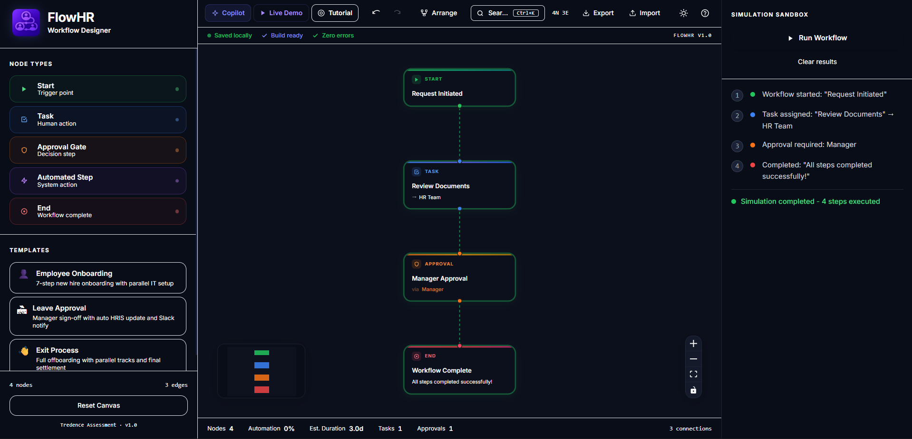
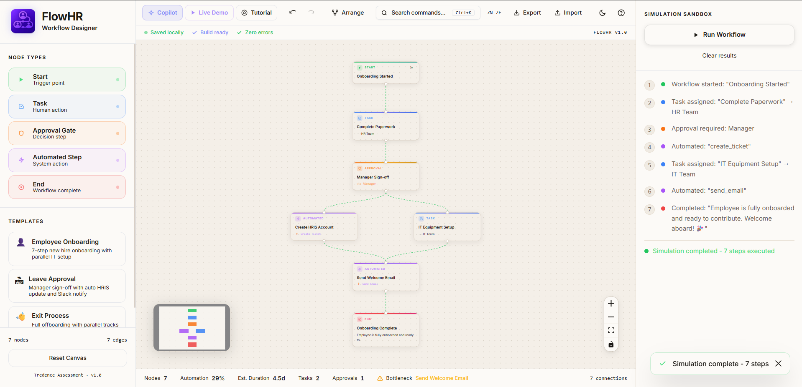
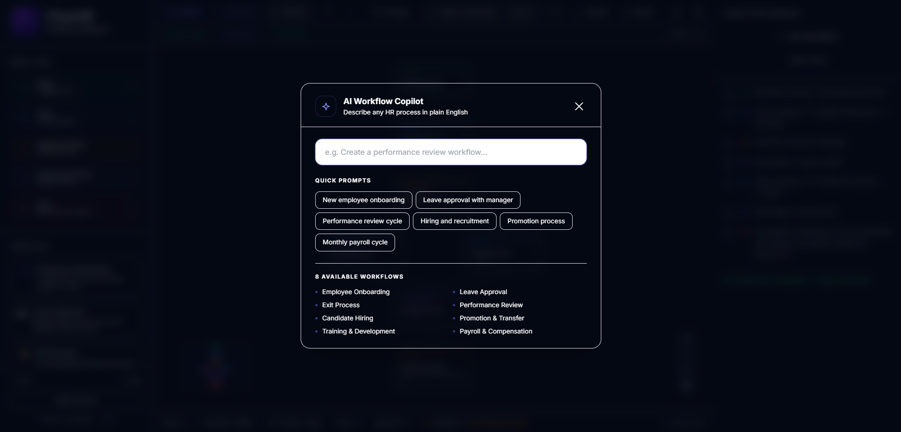
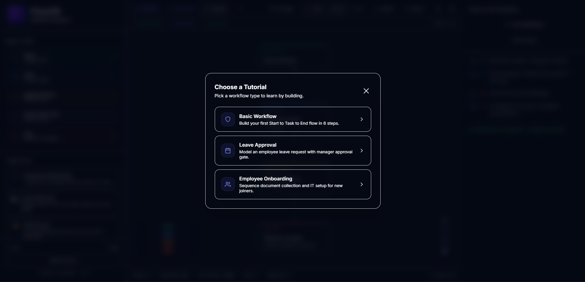

<div align="center">
  
  <h1>FlowHR - Workflow Designer</h1>
  <p><strong>Design, simulate, and automate HR workflows visually. No code required.</strong></p>

  <p>
    <a href="https://flowhr-demo.vercel.app" target="_blank">
      
    </a>
    &nbsp;
    <a href="https://github.com/dhruvgupta-24/Tredence-HR-Workflow-Designer" target="_blank">
      
    </a>
    &nbsp;
    
    &nbsp;
    
  </p>

  <h3><a href="https://flowhr-demo.vercel.app">flowhr-demo.vercel.app</a></h3>
</div>

---

## The Problem

HR teams waste hours every week on processes that should run themselves.

Onboarding a new joiner means chasing 6 different people for approvals. Leave requests sit in inboxes. Performance reviews go missing. Offboarding creates compliance gaps.

Most workflow tools are either too technical (requiring code) or too rigid (no real customization). Teams fall back to spreadsheets, email chains, and Slack reminders.

**FlowHR changes that.** It gives HR teams a visual canvas to design their exact process, simulate it before going live, and understand it at a glance - without writing a single line of code.

---

## Live Demo

**Try it now:** [https://flowhr-demo.vercel.app](https://flowhr-demo.vercel.app)

On the app, click **Live Demo** in the toolbar to see a cinematic 22-second autoplay that builds a complete workflow from scratch. No interaction required.

---

## Key Features

### Visual Drag-and-Drop Builder
Build multi-step workflows using an intuitive node-based canvas. Drag Start, Task, Approval, Automated, and End nodes from the sidebar. Connect them by dragging handles between nodes. Rearrange freely with smooth spring animations.

### AI Copilot - Workflow Generation
Open the Copilot with one click and choose from pre-trained flows: Employee Onboarding, Leave Approval, Performance Review, Exit Clearance, and Project Kickoff. The Copilot generates a fully connected, validated workflow graph in seconds - complete with properly typed node data, edges, and metadata.

### Live Demo Mode
A cinematic 22-second autoplay that builds an entire workflow from scratch in real time. A scripted cursor visits the sidebar, drags each node type to the canvas, connects them, edits a node title with a typewriter effect, and runs the simulation - all timed to feel like a real person using the product.

### Guided Tutorial Mode
A multi-step interactive tutorial with three tracks: Basic Workflow, Leave Approval, and Employee Onboarding. Each step shows a spotlight glow ring around the precise target element (resolved by CSS class selector for canvas nodes, or data-demo-target attribute for sidebar/toolbar elements), a looping ghost cursor demonstrating the expected action (drag, connect, or click), and an animated progress bar. The spotlight uses a requestAnimationFrame loop at 30fps plus a synchronous resize listener so the glow tracks the element without lag as panels resize. The system auto-advances when the Zustand store confirms the expected graph state change.

### Simulation Engine
Click Run Workflow and watch your graph execute step by step. The engine validates the workflow structure first, then walks the graph, animating each node with an indigo glow pulse. Completed nodes turn green. The execution log updates live in the right panel.

### Real-Time Analytics Bar
A persistent footer on the canvas shows live metrics: total nodes, connected edges, estimated completion time, workflow health score, and pending approvals - all computed reactively from the graph state.

### Command Palette (Ctrl+K)
A VS Code-style command palette with fuzzy search. Run Simulation, Open Copilot, Auto Arrange, Open Keyboard Shortcuts, and more - all accessible from the keyboard in under 2 seconds.

### Auto Arrange
One-click layout and graph cleanup. Removes isolated nodes, deduplicates parallel edges, and applies a Dagre-based hierarchical layout algorithm. Shows a toast with exactly how many nodes were removed.

### Import / Export JSON
Export your full workflow as a structured JSON file. Import any previously saved workflow back with one click - validated on load, with error toasts for malformed data.

### Autosave
Workflow state is automatically persisted to `localStorage`. Users return to exactly where they left off. No explicit save button needed.

### Keyboard Shortcuts
Full keyboard navigation: `Ctrl+Z` / `Ctrl+Shift+Z` for undo/redo, `Ctrl+K` for the command palette, `?` for shortcuts modal, `Del` to delete selected nodes, `Esc` to deselect.

### Templates
Four professionally designed workflow templates ship out of the box: Employee Onboarding, Leave Approval, Performance Review, and Exit Clearance. Each is a fully connected, validated graph ready to simulate.

### Validation System
Before simulation runs, the engine checks: Has a Start node? Has an End node? Are all nodes reachable? Are there orphan nodes? Errors surface as clear, dismissible banners.

### Connection Integrity Validation
Strict canvas validation running on every drag event. It actively prevents nodes from connecting to themselves, intercepts duplicate parallel edges, blocks outgoing boundaries on End nodes, and shields Start nodes from incoming paths, rendering contextual toast errors immediately on violation.

### Resizable Layout Engine
Drag horizontally on the inner boundaries of the left and right panels to smoothly expand or shrink your workspace. Complete with strict minimum boundaries (e.g., 260px) and double-click reset constraints. The React Flow canvas instantly recalculates and centers itself as layout dimensions shift.

### Premium Theme System (Light & Dark Modes)
A flawless, real-time theme architecture built with Tailwind CSS and CSS variables. Features a deep, structured Dark Mode and a highly refined warm Light Mode. Includes cinematic circular-reveal transition animations and smooth micro-animations on every hover to replicate a true top-tier SaaS interface without layout shift.

---

## Tech Stack

| Layer | Technology | Why |
|---|---|---|
| Framework | React 18 | Component-based UI, excellent ecosystem |
| Language | TypeScript | Type safety catches entire classes of bugs at compile time |
| Build Tool | Vite 5 | Sub-second HMR, optimized production bundles |
| Styling | Tailwind CSS | Utility-first, consistent 8px grid, tree-shaken bundle |
| Graph Engine | React Flow (@xyflow/react) | Production-grade node/edge canvas with built-in handles and zoom |
| State Management | Zustand | Minimal boilerplate, computed selectors, localStorage persist |
| Animation | Framer Motion | Spring-physics overlays, modals, drawers, and tutorial panels |
| Layout Algorithm | Dagre | Directed acyclic graph layout for auto-arrange |
| Fonts | Inter (Google Fonts) | Most legible UI typeface at small sizes |

---

## Architecture

### Component Structure

```
src/
  components/
    canvas/        # WorkflowCanvas, CanvasControls, StatusBar
    sidebar/       # Sidebar, NodeToolbox, DraggableNode
    nodes/         # StartNode, TaskNode, ApprovalNode, AutomatedNode, EndNode
    forms/         # Property forms for each node type
    copilot/       # CopilotModal
    command/       # CommandPalette (Ctrl+K)
    demo/          # DemoOverlay, FakeCursor, TutorialOverlay
    analytics/     # AnalyticsBar
    sandbox/       # SandboxPanel, ExecutionLog
    ui/            # Button, Drawer, Modal, Toast
```

### State Management

One Zustand store holds all application state: nodes/edges graph data, selected node, simulation progress, undo/redo stacks, and animation state. All state is persisted to `localStorage` via Zustand's `persist` middleware. Undo/redo uses shallow `{nodes, edges}` snapshots pushed on every meaningful change.

### Node System

Each node type is a React component registered with React Flow's `nodeTypes` map. Every node renders from its `data` prop and reads highlight/completed state from the store. Node data shapes are strictly typed via TypeScript interfaces.

### Simulation Engine

`simulateWorkflow(nodes, edges)` performs a simulated async execution log. Before running, the graph is verified via `validateWorkflow()` which checks for structural integrity (no orphan nodes, correct connection rules) and uses **Depth-First Search (DFS)** for precise cycle detection. The simulation itself runs a **Breadth-First Search (BFS)** traversal from the Start node to the End node, building an ordered array of `SimulationStep` objects that the UI layer then animates with timed glowing states.

### Demo Cursor Alignment

The Live Demo uses a known viewport state (`{x:0, y:0, zoom:0.82}`) reset before the script runs. All cursor positions are computed from RF canvas coordinates using `rfToScreen(rfX, rfY, zoom, containerRect)`. Sidebar targets use `getBoundingClientRect()` via `data-demo-target` attributes. Zero hardcoded screen coordinates.

### Templates and Copilot

Templates (`src/data/templates.ts`) and Copilot flows (`src/data/copilotFlows.ts`) are static arrays of nodes and edges with field names that exactly match each node component's `data` interface - a key lesson learned after the blank-screen bug.

---

## Design Decisions

- **Zustand over Context/Redux:** In a graph application, many nodes render simultaneously. React Context triggers a re-render of the entire tree on every state update. Zustand allows us to use specific selectors (`useWorkflowStore(s => s.nodes)`) so that unrelated components don't waste render cycles. It also eliminates Redux boilerplate.
- **Dagre for Auto-Layout:** Calculating an aesthetically pleasing directed acyclic graph layout from scratch is a massive undertaking involving complex edge-intersection math. We integrated `dagre` to compute the hierarchical layout coordinates instantly, mapping the result back into React Flow positions.
- **BFS + DFS Graph Traversal:** Simple array mapping wasn't enough. We implemented DFS specifically to detect circular dependencies (cycles) to block invalid workflows, and BFS during simulation to ensure parallel tasks execute in the correct logical tier visually.
- **Controlled Mock API:** `src/api` is kept entirely separate from UI components. The `automations.ts` stub acts exactly like a real `fetch` call, delaying and returning typed arrays so the `<AutomatedNodeForm>` can dynamically render fields without any hardcoding.

---

## Project Structure

```
Tredence-HR-Workflow-Designer/
  public/
    flowhr-navbar.png
  src/
    api/               # simulate.ts, copilot.ts, automations.ts
    components/        # All UI components
    data/              # templates.ts, copilotFlows.ts
    hooks/             # Custom React hooks
      useLiveDemo.ts   # Live Demo script engine
      useTutorial.ts   # Tutorial step state machine
      useAutoArrange.ts
      useSimulate.ts
      useUndoRedo.ts
    pages/
      WorkflowBuilderPage.tsx
    store/
      workflowStore.ts
      toastStore.ts
    types/             # TypeScript interfaces
    utils/
      serialization.ts
      demoPositions.ts # getBoundingClientRect + RF-to-screen math
    App.tsx
    main.tsx
    index.css
  README.md
  package.json
  vite.config.ts
```

---

## Getting Started

### Prerequisites

- Node.js 18+
- npm 9+

### Run Locally

```bash
git clone https://github.com/dhruvgupta-24/Tredence-HR-Workflow-Designer.git
cd Tredence-HR-Workflow-Designer
npm install
npm run dev
```

Open [http://localhost:5173](http://localhost:5173) in your browser.

### Build for Production

```bash
npm run build
```

Output goes to `dist/`. Bundle: 579KB JS (180KB gzip), 66KB CSS (12KB gzip).

### Type Check

```bash
npx tsc --noEmit
```

---

## Why This Stands Out

Most student projects are CRUD apps or tutorials followed from YouTube.

FlowHR is a **product.** It has a real user problem, a real design system, production-grade state management with undo/redo, a simulation engine with graph validation, and two purpose-built showcase experiences for the recruiter context.

**Product thinking:** The feature set mirrors real HR tools (Kissflow, Process Street) but reimagined as a visual-first, browser-native experience.

**UX polish:** Every interaction has a hover state. Every async operation has a loading state. Errors are never silent. All modals, drawers, toasts, and tutorial panels animate with framer-motion spring physics - not CSS keyframes. All UI chrome icons are SVG, not emoji. The toolbar looks like Linear or Vercel, not a student project.

**Technical depth:** Zustand store with typed state, TypeScript strict mode throughout, Dagre graph layout, BFS validation, undo/redo snapshot history, and DOM-based responsive cursor positioning using real `getBoundingClientRect()` coordinates.

**Recruiter-facing:** The Live Demo sells the product in 22 seconds without any interaction. The Tutorial onboards someone unfamiliar with graph editors in under 2 minutes.

---

## Future Scope

| Feature | Description |
|---|---|
| Backend persistence | Supabase/PostgreSQL to save workflows per user |
| Real-time collaboration | CRDT-based multi-user editing (Liveblocks or Yjs) |
| Live AI integration | GPT-4 / Claude API calls replacing Copilot stubs |
| Analytics history | Track simulation runs, approval rates, bottleneck heatmaps |
| Role-based access | HR admin vs. employee view of workflows |
| Webhook triggers | Real automation - send emails, Slack messages, Jira tickets |
| Mobile view | Read-only workflow viewer for mobile approvers |
| Versioning | Git-style workflow version history with diff viewer |

---

## Product Preview

<p align="center">
  
</p>

<p align="center">
  Premium drag-and-drop HR workflow builder with simulation, AI Copilot, tutorial mode, and dual themes.
</p>

---

## Screenshots

### Main Builder

<p align="center">
  
</p>

### Light Theme

<p align="center">
  
</p>

### AI Workflow Copilot

<p align="center">
  
</p>

### Guided Tutorial Mode

<p align="center">
  
</p>

| View | Description |
|---|---|
| Canvas Builder | Drag-and-drop node editor with sidebar and analytics bar |
| AI Copilot | Chat-style workflow generation modal |
| Live Demo Mode | 22-second cinematic autoplay with scripted cursor |
| Tutorial Mode | Guided tutorial with spotlight and step-specific ghost cursor |
| Simulation | Step-by-step node glow animation with execution log |

---

## License

MIT - free to use, fork, and build upon.

---

<div align="center">
  <p>Built for the Tredence Engineering Internship assessment. Open to feedback.</p>
  <p>
    <a href="https://flowhr-demo.vercel.app">Live Demo</a> ·
    <a href="https://github.com/dhruvgupta-24/Tredence-HR-Workflow-Designer">GitHub</a>
  </p>
</div>
